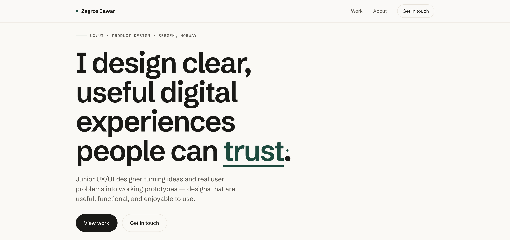

  

## About me

> I'm a UX/UI designer based in Bergen, Norway, currently a Research Assistant at MediaFutures on the CuratedAI project.
>
> 
> I hold two bachelor's degrees from the University of Bergen, Information Science and Media and Interaction Design, a combination that grounds my UX/UI work in both technical systems and human-centered design.
>
> 
> In my bachelor's thesis, I worked in a group of five students in collaboration with MediaFutures to develop VITAL, an AI tool for analyzing health and lifestyle news. It verifies claims based on context, drawing on a large set of already verified news articles, and also analyzes bias and sentiment.
>
> 
> I'm interested in AI transparency, trust in AI powered products, fact checking and verification, and how design can make complex systems understandable.
>
> 
> I design and build: my [portfolio](https://zagrosjawar.com) is hand-coded, and my case studies cover AI, health information, and design to development handoff.

## Skills

| Design | Build | Tools |
|---|---|---|
| User research | HTML5 | Figma |
| Information architecture | CSS3 | Canva |
| Prototyping | JavaScript | VS Code |
| Interaction design | TypeScript | Responsible use of AI tools |
| Usability testing | Python | |
| Accessibility | SQL, Git | |

## Languages

Norwegian, English, Kurdish, Arabic

## Links

- Portfolio: [zagrosjawar.com](https://zagrosjawar.com)
- LinkedIn: [linkedin.com/in/zagrosjawar](https://www.linkedin.com/in/zagrosjawar/)
- Facebook: [facebook.com/profile.php?id=61590391716404](https://www.facebook.com/profile.php?id=61590391716404)

<!---
zagrosjawar/zagrosjawar is a ✨ special ✨ repository because its `README.md` (this file) appears on your GitHub profile.
You can click the Preview link to take a look at your changes.
--->
